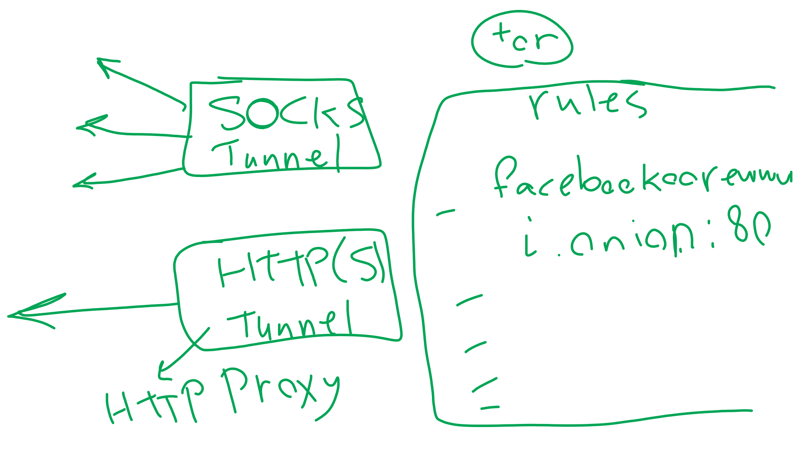

# Onion Tunnel

Onion Tunnel is a simple tunnel app for tunneling every connection through TOR network. The idea of Onion Tunnel is taken from [I2P](https://geti2p.net/en/). It opens a port on localhost for each Hidden Service but TOR does not have such thing. Instead, it opens a SOCKS5 Proxy to tunnel every connection through TOR.

This idea is great but it has a problem:

**What if the application that wants to get traffic from TOR, does not support SOCKS5 proxy?**

Here Onion Tunnel will help. It receives the list of Hidden Onion Addresses (**rules.txt**) and their desired ports and will open two groups of tunnels:

1) SOCKS Tunnel (Direct Tunnel)

2) HTTP(S) Tunnel



## SOCKS Tunnel

SOCKS Tunnel (or Direct Tunnel) does what I2P does. It opens a port on localhost and tunnel every byte received to the hidden service. It should be noticed that if you want to open an HTTP site, you should use HTTP(S) tunnel because when you put the local address (**127.0.0.1:11332** for this example) of a hidden service in browser (consider **127.0.0.1:11332** redirects every byte to **facebookcorewwwi.onion**), then the host parameter sends to FaceBook's hidden service will be **127.0.0.1:11332** and therefore it won't work.

## HTTP(S) Tunnel

This tunnel is a HTTP(S) proxy forked from this repository: https://github.com/stefano-lupo/Java-Proxy-Server. I have changed its structure in order to tunnel traffic into TOR if the URL contains *.onion*

# Configuration

All the configurations are in Variables.java as static variables. Currently I did not implement the parameters as input (for example user cannot change localTorIP or localTorPort). I'll work on it later.

If you want to change any parameters, just change them in **Variables.java**. 

## rules.txt

For creating hidden tunnels, you should create a text file named rules.txt next to the application's directory. Here are some samples:

```
facebookcorewwwi.onion:80
hweqejsy5qkfh5frffbps5peii2eaillxzlbmginzxdwv6352gvrbmyd.onion:80
```

And the output of the application will be something like:

```
[+] Local SOCKS server is ready 127.0.0.1:13005<=>hweqejsy5qkfh5frffbps5peii2eaillxzlbmginzxdwv6352gvrbmyd.onion:80
[+] Local SOCKS server is ready 127.0.0.1:10831<=>facebookcorewwwi.onion:80
[+] Local HTTP/HTTPS server is ready 127.0.0.1:14661<=>127.0.0.1:14661
```

In which shows local IP+Port for each hidden service and also a HTTP(S) proxy.

# Usage

I've recorded a video about my project in action. You can watch it in YouTube. **Do not forget to subscribe to my channel**.

[](https://www.youtube.com/watch?v=0pxDE3vb21M)

# Donate

☕ Don't forget to buy me a cup of coffee

My bitcoin wallet address:

**1F5uiEmdCLJX5KktWHE1wkc63feKJYMmxS**

# Contact

https://mstajbakhsh.ir/contact/
